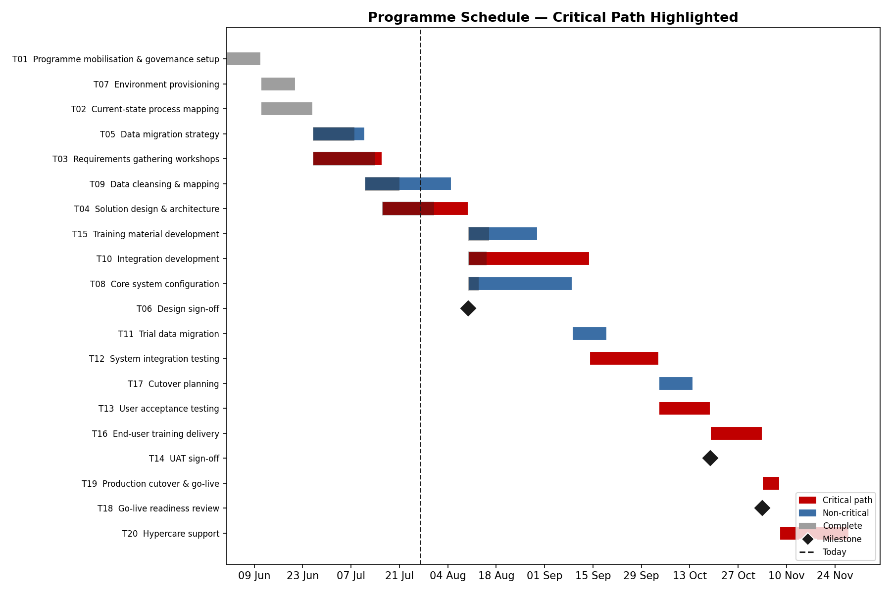
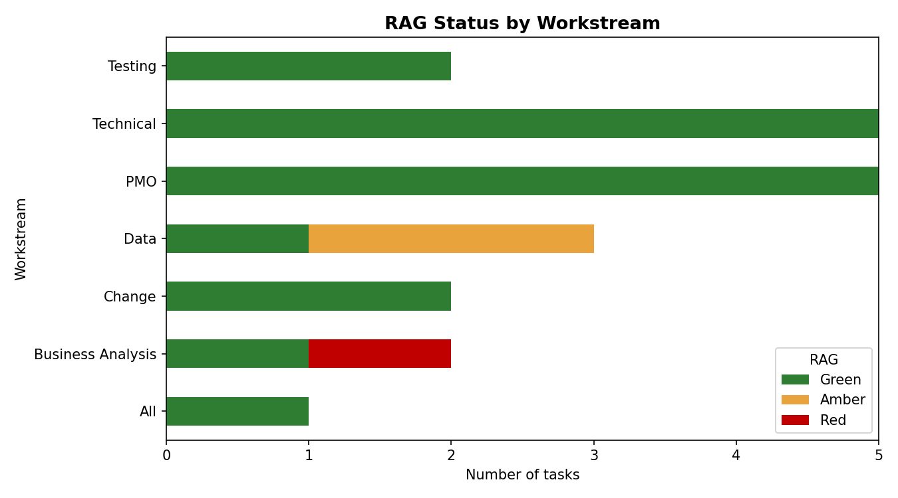
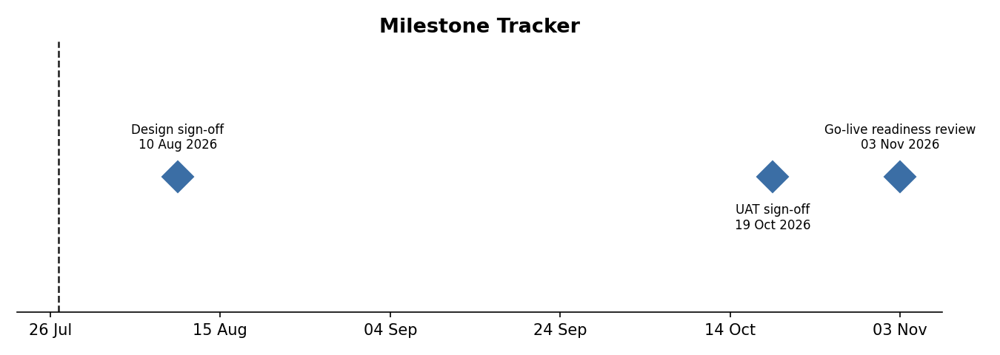

# Programme Schedule Analyser & PMO Dashboard

A Python tool that applies the **Critical Path Method (CPM)** to a programme plan and generates the reporting a PMO produces for Steering Committees: a Gantt chart with the critical path highlighted, a **RAG status** assessment by workstream, and a milestone tracker.

Built to demonstrate practical programme planning and PMO analytics skills — schedule logic, dependency management, float analysis, and executive status reporting — using an example **ERP transformation programme** plan.



## What it does

1. **Loads a programme plan** from a simple CSV (tasks, durations, dependencies, % complete, milestones) — the same structure you would export from Microsoft Project.
2. **Validates the network** — catches unknown dependencies and circular references before scheduling.
3. **Runs CPM scheduling** — forward and backward passes compute early/late start and finish dates, **total float (slack)** for every task, and the **critical path**.
4. **Assesses RAG status** with transparent, rule-based logic:
   - **Green** — complete, not yet due, or progress at/ahead of schedule expectation
   - **Amber** — behind expected progress, but float can absorb the slip
   - **Red** — behind expected progress on a **critical-path task** (no float) → escalate
5. **Generates PMO reporting**:
   - Gantt chart with critical path, progress overlay, milestones and reporting date
   - RAG summary by workstream (stacked bar)
   - Milestone tracker timeline
   - CSV outputs for the full schedule analysis and RAG table

## Example output

```
Programme duration: 180 working days

Critical path:
  T01  Programme mobilisation & governance setup  (10d)
  T02  Current-state process mapping              (15d)
  T03  Requirements gathering workshops           (20d)
  T04  Solution design & architecture             (25d)
  ...

RED items requiring escalation:
  T03  Requirements gathering workshops  (90% complete)
```

| RAG by workstream | Milestone tracker |
| --- | --- |
|  |  |

## How to run

```bash
pip install -r requirements.txt
python main.py
```

Optional arguments:

```bash
python main.py --schedule programme_schedule.csv \
                --start 2026-06-01 \
                --today 2026-07-27
```

Swap in your own plan by editing `programme_schedule.csv`. Dependencies are semicolon-separated task IDs (e.g. `T08;T09`), and milestones are zero-duration tasks flagged with `is_milestone = 1`.

## Why these techniques matter in a PMO

- **Critical path & float** tell a planner *which* slippages actually move the go-live date and which can be absorbed — the difference between escalation and noise.
- **Rule-based RAG** removes subjectivity from status reporting: a task is Red because it is behind *and* has no float, not because someone feels nervous.
- **Milestone tracking** gives leadership the five-slide view: are the governance gates (design sign-off, UAT sign-off, go-live readiness) still on track?

## Project structure

```
├── main.py                       # CLI entry point
├── cpm.py                        # CPM engine: validation, forward/backward pass, float
├── dashboard.py                  # RAG logic + chart generation
├── programme_schedule.csv        # Example ERP transformation plan (20 tasks)
├── requirements.txt
├── gantt_critical_path.png       # Generated: Gantt chart with critical path
├── rag_by_workstream.png         # Generated: RAG summary by workstream
├── milestone_tracker.png         # Generated: milestone tracker timeline
├── schedule_analysis.csv         # Generated: full schedule analysis table
└── rag_status.csv                # Generated: RAG status table
```

## Tech

Python · pandas · matplotlib — no scheduling libraries used; the CPM algorithm (topological sort, forward/backward pass, float computation) is implemented from scratch in `cpm.py`.

## Roadmap

- [ ] Resource loading and over-allocation detection
- [ ] Baseline vs. actual variance reporting
- [ ] Monte Carlo schedule risk simulation (P50/P80 finish dates)
- [ ] Export to Power BI-ready star schema

---

*Author: Viswanadham Ampolu — MSc Engineering Management, University of East London.*
*[LinkedIn](https://www.linkedin.com/in/viswanadham-ampolu) · [GitHub](https://github.com/vissuampolu07)*
